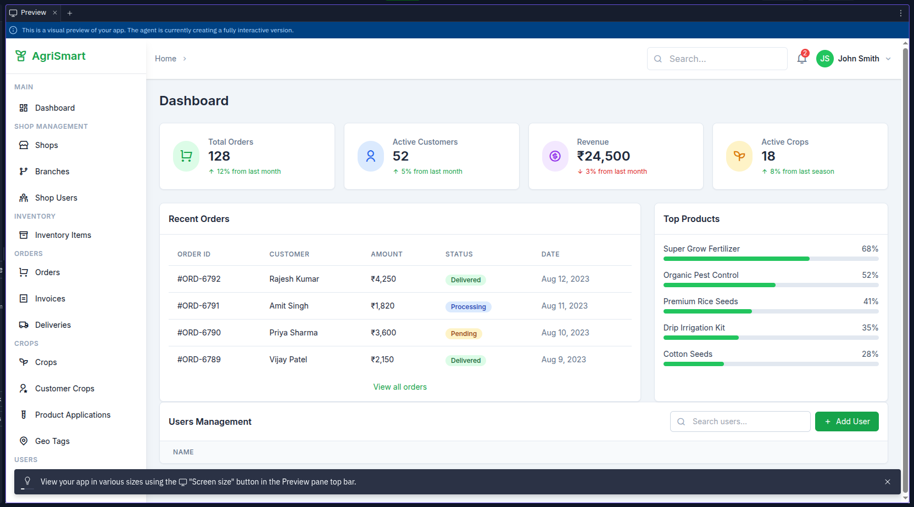

# 🌿 AgriSmart

AgriSmart is a responsive, modern dashboard application built for managing agriculture operations. It helps track orders, monitor customer activity, analyze revenue trends, and manage crop and product data with ease.

## 📸 Screenshot



---

## 🚀 Features

- 📦 Total Orders, Revenue, Customers & Active Crops
- 📊 Top Products Analysis with Progress Indicators
- 📋 Recent Orders Table with Order Status
- 🧩 Reusable Card & Layout Components
- 💡 Built using shadcn/ui, TailwindCSS, and React
- 📱 Fully responsive and mobile-ready

---

## 🧪 Tech Stack

| Technology   | Purpose                          |
| ------------ | -------------------------------- |
| React        | UI Framework                     |
| TypeScript   | Static Typing                    |
| shadcn/ui    | UI Components (Radix + Tailwind) |
| TailwindCSS  | Utility-first Styling            |
| Lucide Icons | Iconography                      |
| Vite / CRA   | Build Tool (choose one)          |

---

## 📁 Project Structure

```
AgriSmart-web/
├── public/ # Static files
├── src/
│ ├── components/ # Reusable UI Components
│ ├── pages/ # Page-level components (Dashboard, etc.)
│ ├── layout/ # Layout and wrappers (PageWrapper, etc.)
│ ├── App.tsx # App entry point
│ ├── main.tsx # ReactDOM entry
│ └── index.css # TailwindCSS & global styles
├── tailwind.config.js
├── tsconfig.json
├── package.json
└── README.md
```

## ⚙️ Getting Started

### 1. Clone the repo

```bash
git clone https://github.com/ingale12345/AgriSmart-web.git
cd AgriSmart-web
```

### 2. Install dependencies
```
npm install
or 
yarn install
```
### 3. Start the development server
```
npm run dev
# or
yarn dev
```

🧑‍💻 Author
Made with 💚 by @ingale12345

### 📌 Future Enhancements
 ###### API integration for real data

 ###### User authentication and roles

 ###### Export reports (PDF/Excel)
